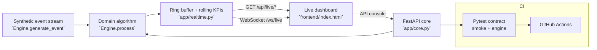

# VITALS — Live Environmental Early-Warning

**Domain:** Predictive Analytics · Real-Time Monitoring

## Problem

Environmental hazards — extreme heat, storms, pressure drops — develop gradually across distributed sites; manual spot-checks and siloed sensor logs miss multi-signal deterioration arcs before they become critical, leaving operations teams responding reactively instead of ahead of the curve.

## Solution

A streaming site-health early-warning system that polls REAL current weather data from Open-Meteo for 10 major-city stations and runs a NEWS2-style banded scoring algorithm: five environmental signals (temperature, feels-like, wind speed, humidity, pressure) each mapped to 0-3 risk points via calibrated threshold bands, summed into an aggregate score, and triaged green / amber / red with per-station trend detection over a rolling window. When an OPENROUTER_API_KEY is set, OpenRouter generates a one-line LLM risk advisory for non-green alerts; without a key the engine falls back to deterministic summaries.  Every event is tagged source='live' (real data) or source='fallback' (offline synthetic) and observable on a live dashboard.

## Why this project for the **App Engineer (AI & Automation)** role at **LaunchDarkly**

This system was scoped to demonstrate, end to end, the skills the job description emphasises: **Python**. Milestone M1 is fully implemented and tested in this repo; M2–M4 are the documented growth path.

## Architecture



## Real-time architecture

The domain engine (`app/engine.py`) is a stream processor: `generate_event()`
emits realistic synthetic domain events (with injected anomalies),
`process()` runs the real algorithm over each one, and rolling KPI windows
(`collections.deque`) keep memory bounded under an infinite stream.

Liveness works in two modes, so the system is genuinely live anywhere:

- **Persistent server** (uvicorn / Docker): an asyncio background ticker
  advances the simulation ~every 0.7s and pushes events + KPIs to WebSocket
  subscribers on `/ws/live`.
- **Serverless** (Vercel, env `VERCEL` set): no background process exists, so
  `GET /api/live/events` and `GET /api/live/kpis` advance the simulation
  *lazily* from elapsed wall time (~2 events/sec, capped per call). The
  dashboard automatically falls back from WebSocket to 1.5s polling.

Every processed event carries a monotonic `seq`, a `severity`
(`ok`/`warn`/`critical`) and a human-readable `summary` — the contract the
dashboard, the live feed and the test-suite all share.

The engine is intentionally dependency-free (FastAPI + stdlib) so it runs anywhere in seconds; every integration point for production hardening is marked in the milestone plan.

## API surface

| Method | Path |
|---|---|
| `GET` | `/health` |
| `POST` | `/api/reading` |
| `POST` | `/api/reading` |
| `GET` | `/api/alert-queue` |
| `GET` | `/api/live/events?since=<seq>` |
| `GET` | `/api/live/kpis` |
| `WS` | `/ws/live` |

Interactive docs: `http://localhost:8000/docs`

## Quickstart

```bash
cd backend
pip install -r requirements.txt
uvicorn app.main:app --reload          # http://localhost:8000
python -m pytest -q                    # smoke + engine contract
```

Or with Docker:

```bash
docker compose up --build
```

## Impact

- Trend detection flags rising risk trajectories before any single signal crosses the red threshold — earlier escalation opportunity across all sites
- Per-signal contribution breakdown makes every triage level fully explainable — satisfying auditability requirements for operational AI

## Roadmap

- M1 (shipped in scaffold): real Open-Meteo weather polling, NEWS2-style banded scoring (5 environmental signals), per-station trend detection, alert queue, live ops dashboard, CI
- M2: additional signal sources (air-quality AQI, UV index) + alert notification webhooks
- M3: ML anomaly-detection model (Isolation Forest / LSTM) behind the same scoring contract — model vs rules A/B comparison
- M4: role-based access, audit trail, multi-tenant station management, GIS map overlay, Railway/Render deploy

## Tech & concepts

Predictive Analytics, Anomaly Detection, Time Series, Python, FastAPI, Monitoring & Observability
